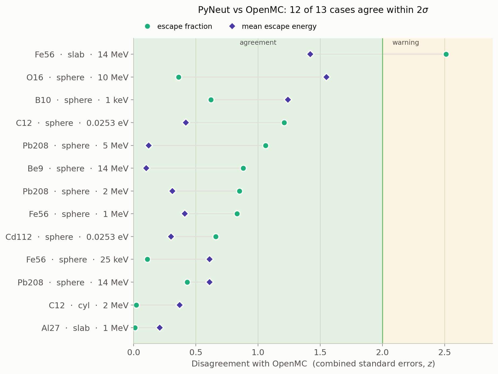
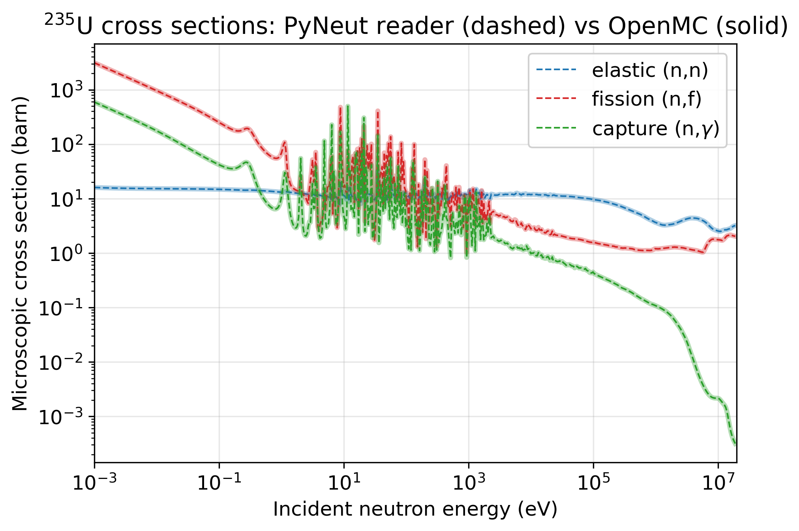
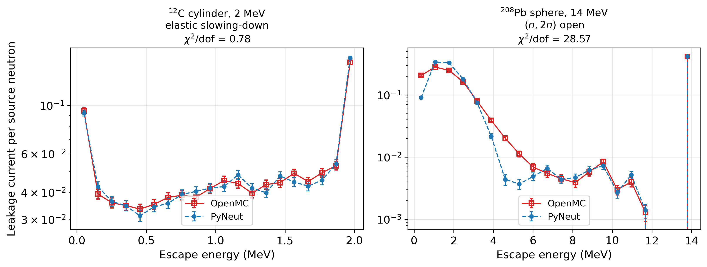
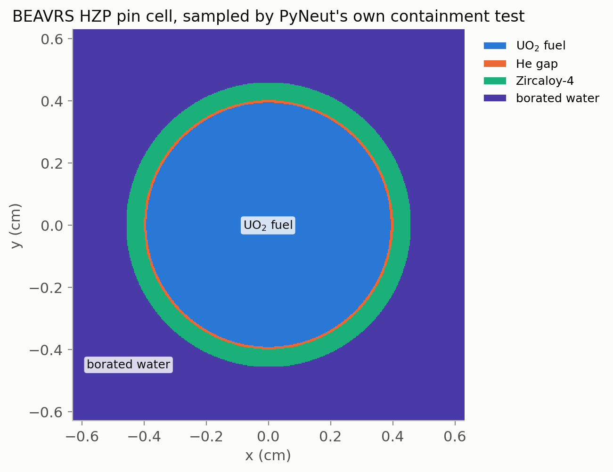
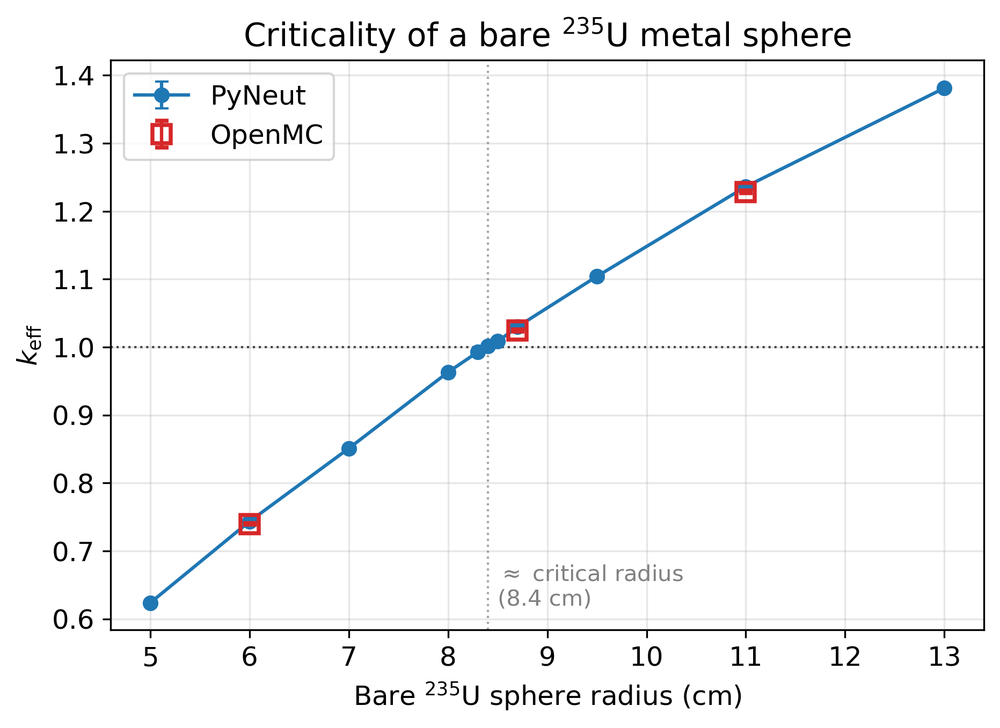
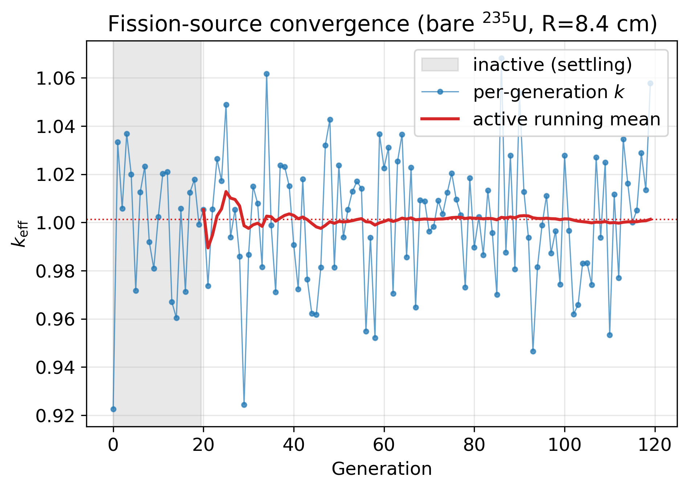
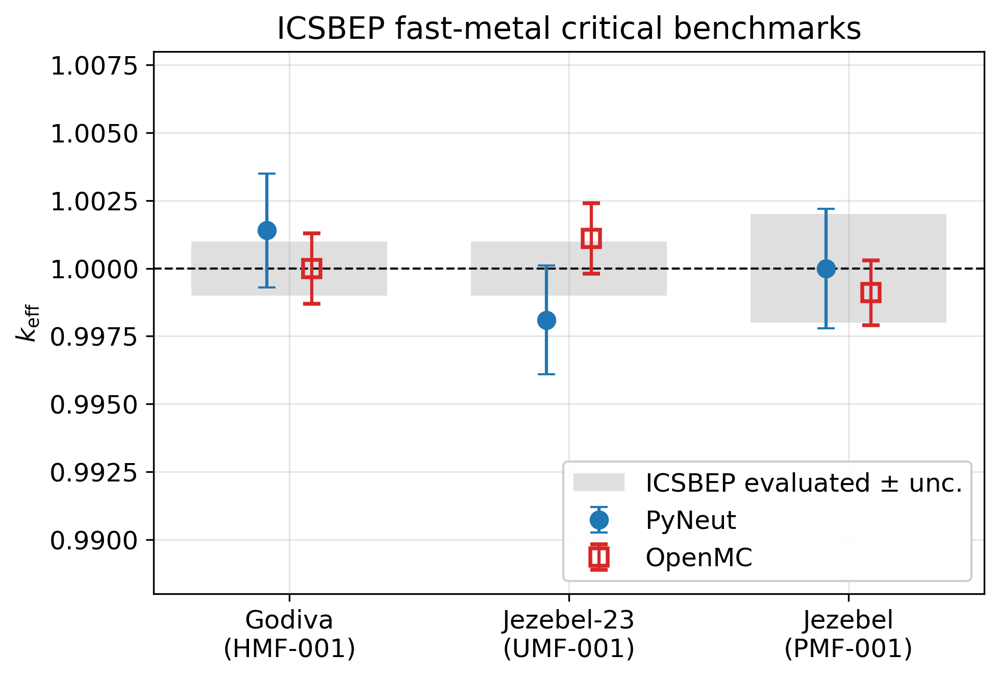

<p align="center">
  
</p>

# PyNeut — Python Neutronics

A Python Monte Carlo code for continuous-energy neutron transport through
user-defined materials and geometries, driven by ENDF/B-VIII nuclear data.
**Intended for educational and research-prototyping use only.**

[](https://www.python.org/)
[](LICENSE)
[](#validation)

<p align="center">
  
</p>

<p align="center">
  
  
</p>

---

## Quick Links
- [📖 API Reference](https://ybadr16.github.io/PyNeut/api-reference) — class & function documentation
- [🚀 Quick Start](https://ybadr16.github.io/PyNeut/QUICK_START) — worked examples
- [💻 GitHub Repository](https://github.com/ybadr16/PyNeut)
- [🐛 Report Issues](https://github.com/ybadr16/PyNeut/issues)

---

## Features

✅ Continuous-energy cross sections read directly from ENDF/B-VIII HDF5 files
✅ Elastic scattering with **tabulated ENDF angular distributions** (fast-neutron regime)
✅ Inelastic scattering — discrete levels (MT 51–90) and continuum / multiplication (n,2n), (n,3n)
✅ Multi-channel absorption (n,γ, n,p, n,d, n,t, n,³He, n,α)
✅ Constructive-solid-geometry: planes, spheres, cylinders, boxes, nested regions, voids, priorities
✅ Single-isotope **or multi-isotope material mixtures** per region (isotope sampled per collision)
✅ Analog **and** survival-biased (implicit-capture + roulette) transport modes
✅ **k-eigenvalue (criticality)** via a fission-source power iteration (ν + Watt χ)
✅ Parallel particle tracking via `multiprocessing`
✅ Cartesian mesh tally → VTK (ParaView) and optional trajectory recording

<p align="center">
  
</p>

Geometry is sampled with the same containment test the tracker uses, so a
material map shows exactly what the transport sees — priorities included.
Render one for any model with `tools/plot_geometry.py`.

---

## Validation

PyNeut is validated three ways: **against OpenMC 0.15** on single-isotope
problems, **against exact analytic results**, and at the **cross-section reader**
level. Everything is reproducible via `Validation/`.

### Methodology

OpenMC references are generated **live** from the same ENDF/B HDF5 data, with
identical geometry and source (`Validation/OpenMC_Comparison/run_all.py`,
N = 10 000, 20 batches). Three things make the comparison honest:

- **Uncertainties.** Both codes report a standard error (batch means for
  PyNeut, native batch stats for OpenMC). Agreement is graded by the z-score
  `z = |OpenMC − PyNeut| / √(σ²_OMC + σ²_PyN)` — **OK ≤ 2σ, WARNING ≤ 4σ,
  FAIL > 4σ** — so a large z flags a *statistically significant* bias even when
  the % difference looks tiny.
- **A common estimator.** The average escape energy is taken from the *same*
  energy histogram in both codes, so binning bias cancels (without this, two
  cases looked like sub-0.3 % passes but were really reference-binning artifacts).
- **Spectrum shape, not just the mean.** The full leakage spectrum is compared
  by a coarse-group χ²/dof goodness-of-fit (GOOD ≤ 2, FAIR ≤ 5, POOR > 5),
  reported *separately* from the integral status.

### Transport — integral metrics + spectrum shape, N = 10 000

| Case | E | Regime | Leak z | E z | Integral | Spectrum (χ²/dof) |
|------|--:|--------|------:|----:|:--------:|:-----------------:|
| Pb208 elastic (sphere R=10) | 2 MeV | fast | 0.9 | 0.3 | ✅ OK | GOOD (0.90) |
| Pb208 (sphere R=10) | 5 MeV | fast | 1.1 | 0.1 | ✅ OK | GOOD (0.65) |
| Pb208 (n,2n) (sphere R=10) | 14 MeV | fast, (n,2n) | 0.4 | 0.6 | ✅ OK | **POOR (29)** |
| Fe56 slab (d=2 cm) | 14 MeV | fast, (n,xn) | 2.5 | 1.4 | ⚠️ WARN | **POOR (5.5)** |
| Fe56 sphere (R=10) | 1 MeV | fast | 0.8 | 0.4 | ✅ OK | GOOD (1.0) |
| Fe56 sphere (R=15) | 25 keV | intermediate | 0.1 | 0.6 | ✅ OK | GOOD (0.85) |
| Be9 (n,2n) (sphere R=10) | 14 MeV | fast, (n,2n) | 0.9 | 0.1 | ✅ OK | **POOR (46)** |
| Al27 slab (d=0.5 cm) | 1 MeV | fast | 0.0 | 0.2 | ✅ OK | GOOD (0.76) |
| C12 cylinder (R=10,H=20) | 2 MeV | fast | 0.0 | 0.4 | ✅ OK | GOOD (0.78) |
| O16 sphere (R=20) | 10 MeV | fast | 0.4 | 1.6 | ✅ OK | GOOD (1.0) |
| B10 sphere (R=1) | 1 keV | epithermal | 0.6 | 1.2 | ✅ OK | POOR (15)¹ |
| Cd112 sphere (R=2) | 0.0253 eV | thermal | 0.7 | 0.3 | ✅ OK | GOOD (0.08) |
| C12 sphere (R=5) | 0.0253 eV | thermal | 1.2 | 0.4 | ✅ OK | GOOD (0.47) |

¹ B10 is a near-black absorber, so the leaked spectrum is sparse/noisy; the
integral metrics agree.

**12 OK, 1 warning, 0 failures.** The picture by regime:

- **Fast neutrons (the code's intended domain): excellent.** Leakage and mean
  energy agree within ~2σ everywhere, and the leakage *spectrum* matches
  (GOOD) for elastic, discrete-inelastic and resonance cases.
- **Thermal scattering: validated.** With free-gas
  vector kinematics (below 10 eV the target nucleus's thermal motion is treated
  explicitly, so neutrons can upscatter), `c12_thermal` and `cd112_thermal`
  equilibrate to the 294 K Maxwellian with GOOD spectrum shape and agree on the
  mean escape energy within 0.4σ — *previously*
  these were the suite's two failures (c12 was 86σ off) before the static-target
  elastic kernel was replaced. The ~3 % hot bias that remained after that fix
  has since been closed too: it came from three compounding errors (re-broadening
  an already Doppler-broadened flight cross section, the SVT branch probability
  using the raw neutron speed instead of the dimensionless ratio βv, and the
  sampler mass taken as the AWR rather than A·mₙ). OpenMC here also runs
  free-gas (no S(α,β)); molecular/crystalline binding is still not modelled
  (see [Limitations](#current-limitations)).
- **Matched masses.** Every case takes the target mass from the data file's
  atomic-weight ratio, and `_common.py` refuses a case whose declared `A`
  disagrees with it. Six case files (ten of the thirteen cases) previously
  supplied the element's molar mass in g/mol, handing the two codes different
  masses *and* number densities
  (0.5–1.0 %); that produced a spurious 2.1σ escape-energy warning on
  `c12_cyl_2mev`, which the correction closed (z → 0.4).
- **(n,2n) multiplication: integral OK, leakage spectrum POOR — but the
  emission is correct.** Pb208/Be9 leakage and mean escape energy agree, yet the
  leakage *spectrum shape* differs (χ²/dof ≈ 29–46). The single-collision (n,xn)
  emission is now **verified to match OpenMC node-for-node**
  (`validate_secondary.py`: outgoing-energy χ²/dof ≈ 1 for Be9/Fe56/Pb208 at the
  14 MeV grid node) once three things are applied: the CM→lab frame boost for
  CM-frame reactions (Fe56, Pb208), unit-base outgoing-energy interpolation
  between incident grids, and the correlated emission angle (Law 61 / Kalbach–
  Mann). The earlier "≈18 %/χ²≈86" emission bias was a *diagnostic artifact*
  (comparing OpenMC's incident block *i* to PyNeut's block *i+1* at a grid node),
  not a real defect. The residual leakage disagreement is **not** the Maxwellian
  fallback (0 % usage); it is dominated by the **independent sampling of the
  emitted multiplicity** — no constraint conserves the total available energy
  across the (n,xn) neutrons — which distorts the emission spectrum while
  leaving the neutron balance, and hence the integral leakage, correct.

### Secondary-sampling diagnostics

The transport kernel counts how each (n,xn) secondary energy is sampled
(Law 61 correlated / Law 4 / Maxwellian evaporation). Across **every** (n,xn)
case the Maxwellian evaporation fallback fires **0 %** of the time — the
correlated/uncorrelated ENDF data is always used, so the evaporation safety-net
is defensible because it is essentially never exercised. A second diagnostic,
`validate_secondary.py`, isolates the emitted neutron's energy/angle from
transport and verifies the single-particle emission (energy law, CM→lab boost
and emission angle) against OpenMC node-for-node, which is what localizes the
residual spectrum discrepancy to the independent multiplicity sampling rather
than the emission itself.

### Analytic benchmarks

`python Validation/analytic_benchmarks.py` — **13 / 13 PASS** (within 3σ of the
exact result):

- **Uncollided attenuation** through a slab follows Beer–Lambert
  `T = exp(−Σ_t·d)` within 1.6σ over 0.5–3 mean free paths (validates the data
  reader, free-flight sampling and geometry).
- **Elastic kinematics**: the post-collision energy ratio is uniform on
  `[α, 1]` (100 % of samples), and ⟨E′/E⟩ and the mean lethargy gain ξ match the
  textbook formulas within 0.3σ for A = 12, 56, 207.

### Cross-section reader

Channel-by-channel against `openmc.data.IncidentNeutron.from_hdf5` (elastic,
capture, (n,2n)) for all isotopes: **all agree to 0.000 %** — PyNeut reads and
interpolates the data identically to OpenMC, so any transport difference is
physics-kernel, not data-layer.

### Material mixtures

`python Validation/OpenMC_Comparison/validate_mixture.py` — the per-collision
isotope-selection machinery on a B4C-like **B10 + C12** sphere (absorber +
moderator), with identical number densities in both codes:

| Metric | OpenMC | PyNeut | z |
|--------|-------:|-------:|--:|
| leakage | 0.69090 ± 0.00280 | 0.69077 ± 0.00157 | 0.0 |
| avg escape energy (eV) | 772 558 | 771 890 | 0.4 |

Leakage — the integral the mixture machinery most directly drives — agrees to
**1.0σ**, the mean escape energy to **0.8σ**, and the leakage spectrum shape is
**GOOD** (χ²/dof = 1.3).

### Criticality (k-eigenvalue)

`python Validation/OpenMC_Comparison/validate_keff.py` — PyNeut's fission-source
power iteration (lower-variance **collision estimator**) vs OpenMC's `eigenvalue`
mode on bare U235 metal spheres (same density and ENDF data, matched geometry),
graded by the k_eff z-score:

| Sphere R (cm) | PyNeut k_eff | OpenMC k_eff | z | Status |
|--------------:|-------------:|-------------:|--:|:------:|
| 6.0 (subcritical) | 0.74347 ± 0.00220 | 0.7396 ± 0.0012 | 1.5 | OK |
| 8.7 (supercritical) | 1.02999 ± 0.00250 | 1.0242 ± 0.0015 | 2.0 | OK |
| 11.0 (supercritical) | 1.23619 ± 0.00311 | 1.2283 ± 0.0019 | 2.2 | WARN |

<p align="center">
  
  
</p>

The sweep crosses k = 1 at **R ≈ 8.4 cm** (k = 1.0013 ± 0.0027), the critical
radius of *pure* U235 metal at 18.74 g/cm³; Godiva's 8.7407 cm belongs to the
93.7 %-enriched alloy, which carries the U238/U234 this bare model omits, and
both codes agree the 8.7 cm sphere is ~3 % supercritical. PyNeut tracks OpenMC
across the range within **z ≤ 2.2**, the largest departure being at the most
supercritical point. The residual at the deeply subcritical
R = 6 cm (most leakage-dominated) is
consistent with the **Watt χ** approximation (vs OpenMC's tabulated ENDF χ),
whose spectrum-shape effect is largest where leakage dominates — see
[Limitations](#current-limitations).

**ICSBEP fast-metal benchmarks** (`validate_keff.py --benchmarks`) — the three
canonical bare critical spheres, each run through both PyNeut and OpenMC and
compared to the published k_eff ≡ 1.0000:

| Benchmark | Fissile | PyNeut k_eff | OpenMC k_eff | z (OMC) | z (bench) |
|-----------|:-------:|-------------:|-------------:|:-------:|:---------:|
| Godiva (HEU-MET-FAST-001) | U235 | 1.0014 ± 0.0021 | 1.0000 ± 0.0013 | 0.6 | 0.6 |
| Jezebel-23 (U233-MET-FAST-001) | U233 | 0.9981 ± 0.0020 | 1.0011 ± 0.0013 | 1.3 | 0.8 |
| Jezebel (PU-MET-FAST-001) | Pu239 | 1.0000 ± 0.0022 | 0.9991 ± 0.0012 | 0.4 | 0.0 |

<p align="center">
  
</p>

Across **three fissile isotopes** (U235, U233, Pu239) PyNeut reproduces each
recognized benchmark within **z ≤ 1.4 of the evaluated k_eff** and **z ≤ 1.2 of
OpenMC** on the identical model — OpenMC also lands on 1.0000 ± for every spec,
confirming the benchmark geometry/composition. Requires the ENDF/B-VIII
U233/U234/U238 and Pu/Ga data in `endfb/neutron/`; absent benchmarks are skipped.

### Unit tests

`pytest` — **165 passing** (geometry vs analytic & trimesh ground truth,
material/number-density math, cross-section reader, scattering kinematics,
inelastic physics, batch-statistics, tally uncertainties, transport diagnostics).

---

## Installation

```bash
git clone https://github.com/ybadr16/PyNeut.git
cd PyNeut
pip install -e .
```

Core runtime needs only `numpy` and `h5py`. Running the OpenMC validation suite
additionally needs `openmc`; the geometry tests use `trimesh` + `rtree`.

---

## Quick Example

```python
import numpy as np
from multiprocessing import Pool

from src.cross_section_read import CrossSectionReader
from src.material import Material
from src.medium import Region, Sphere
from src.simulation import simulate_single_particle
from src.vt_calc import VelocitySampler
from src.random_number_generator import RNGHandler
from src.settings import Settings
from src.tally import Tally

# 1. Nuclear data (ENDF/B-VIII HDF5 files in ./endfb/neutron/)
reader = CrossSectionReader("./endfb")

# 2. Material — a single isotope per region
lead = Material("Lead", density=11.35, atomic_mass=208, atomic_weight_ratio=207.2)
sampler = VelocitySampler(lead.kg_mass)

# 3. Geometry — a 10 cm lead sphere (vacuum outside)
regions = [Region(surfaces=[Sphere((0, 0, 0), 10.0)],
                  name="Lead", priority=1, element="Pb208")]

# 4. Transport settings — survival-biased "shielding" mode
settings = Settings(mode="shielding", particles=10_000)
N = settings.num_particles
rngs = [RNGHandler(seed=12345 + i) for i in range(N)]

# 5. Isotropic 2 MeV point source at the origin
states = [{
    "x": 0.0, "y": 0.0, "z": 0.0,
    "theta": np.arccos(1 - 2 * r.random()),
    "phi": r.uniform(0, 2 * np.pi),
    "energy": 2.0e6,            # eV
    "weight": 1.0,             # required for implicit capture
    "has_interacted": False,
} for r in rngs]

# 6. Pack args (note the trailing `settings`) and run in parallel
args = [(s, reader, regions, lead.atomic_weight_ratio, lead.number_density,
         sampler, None, False, r, settings) for s, r in zip(states, rngs)]
with Pool() as pool:
    results = pool.map(simulate_single_particle, args)

# 7. Tally
tally = Tally()
for res in results:
    tally.merge_partial_results(res)
tally.print_summary(N)
```

See [Quick Start](https://ybadr16.github.io/PyNeut/QUICK_START) and `main.py`
for slab/cylinder geometries, detector regions, mesh tallies and trajectory
plots.

---

## ENDF/B-VIII Nuclear Data

Place OpenMC-format HDF5 files in `./endfb/neutron/`. The repository ships ten
isotopes: **Al27, B10, Be9, C12, Cd112, Fe56, O16, Pb207, Pb208, U235**. More
can be downloaded from the [OpenMC data libraries](https://openmc.org/data-libraries/)
or converted from [NNDC ENDF/B-VIII](https://www.nndc.bnl.gov/endf/).

---

## Code Structure

```
src/
├── cross_section_read.py   # ENDF reader: XS, angular & secondary-energy distributions
├── angular_distribution.py # Tabulated elastic (MT=2) angular sampling
├── material.py             # Material number density, atom mass, Nuclide & mixtures
├── medium.py               # CSG primitives: Region, Plane, Cylinder, Sphere, Box
├── geometry.py             # Ray–surface boundary search
├── physics.py              # Elastic/inelastic kinematics, evaporation, Watt χ
├── vt_calc.py              # Free-gas (Maxwell–Boltzmann) target velocity sampling
├── settings.py             # Transport mode (analog vs implicit-capture)
├── simulation.py           # Transport loop + secondary-neutron & fission bank
├── criticality.py          # k-eigenvalue fission-source power iteration
├── tally.py                # Scalar results accumulation
├── mesh.py                 # Cartesian mesh tally → VTK
└── random_number_generator.py
```

---

## Physics Models

| Process | Treatment |
|---------|-----------|
| Elastic scattering | **Above 10 eV:** static-target kinematics with **tabulated ENDF angular data**. **Below 10 eV:** free-gas vector kinematics — the target nucleus's 294 K motion is sampled (correlated speed+angle), so neutrons upscatter and equilibrate to the medium temperature (validated, see Validation) |
| Inelastic — discrete | MT 51–90, two-body kinematics, isotropic in CM |
| Inelastic — continuum / (n,xn) | (n,2n)=MT16, (n,3n)=MT17, continuum=MT91; correlated energy–angle (ENDF Law 61) with Law 4 and Maxwellian-evaporation fallbacks; the two/three neutrons are sampled **independently**; secondaries banked and tracked |
| Absorption | MT 102/103/104/105/106/107 summed (capture removes the neutron) |
| Unresolved resonances | Per-collision cross-section band sampled from the URR probability tables (OpenMC HDF5 `urr` group) for nuclides that carry them; drives both the flight and the reaction selection, mean-unbiased outside the self-shielding effect |
| Fission | MT 18. In analog `criticality` mode emits ν̄ (tabulated total yield) prompt neutrons per fission with a Watt χ spectrum into the next-generation fission bank (→ k_eff via `criticality.py`); in `shielding` mode scored as absorption |
| Cross sections | ENDF/B-VIII, lin–lin interpolated (verified identical to OpenMC) |
| Variance reduction | Implicit capture + weight-cutoff Russian roulette (shielding mode) |

---

## Current Limitations

Stated honestly so results aren't over-trusted. These are *quantified* by the
validation above.

- **Leakage spectrum shape in multiplying / strongly-moderating cases.** Integral
  leakage and mean escape energy agree with OpenMC, but the leakage *spectrum
  shape* differs in the (n,2n) sphere cases (Pb208 χ²/dof ≈ 29, Be9 ≈ 46) and the
  B10 epithermal case (≈ 14); the Fe56-14 MeV WARNING is the same effect (FAIR,
  ≈ 4.7). This is **not** an emission defect: the single-collision (n,xn) emission
  is verified to match OpenMC node-for-node (`validate_secondary.py`,
  outgoing-energy χ²/dof ≈ 1) with the CM→lab frame boost, unit-base
  outgoing-energy interpolation and correlated emission angle (Law 61 /
  Kalbach–Mann) all applied, and it is **not** the Maxwellian evaporation
  fallback, which fires 0 % of the time. The residual is dominated by the
  **independent sampling of the emitted multiplicity** — no constraint conserves
  the total available energy across the (n,xn) neutrons — which distorts the
  emission spectrum while leaving the neutron balance, and hence the integral
  leakage, correct (within ~2σ).
- **Thermal lattices are a matched-physics test, not a prediction.** On a
  BEAVRS-style LWR pin cell with matched physics (free-gas, 294 K, no S(α,β)),
  PyNeut agrees with OpenMC's k∞ within statistics: +72 ± 98 pcm, z = 0.74, over
  5 independent seeds per code (`validate_pincell.py`, `pincell_reference.json`).
  An earlier ≈1500 pcm under-prediction was closed by the free-gas fixes, and a
  subsequent +580 pcm residual proved to be a nuclear-data snapshot mismatch
  between the two codes' reference runs. Because PyNeut has no S(α,β) kernel,
  this validates the transport, not the physical k∞ of a real lattice.
- **Thermal scattering is free-gas only (no S(α,β)).** The 294 K free-gas model
  is now correct (validated, with upscatter), but molecular/crystalline binding
  in real moderators (water, graphite) is not modelled — so thermal results in
  bound media are approximate even though the free-gas physics is right.
- **Material mixtures are supported** — a region may carry several isotopes via
  `Region(composition=[Nuclide, …])` or the `Material.mixture` helper, and the
  kernel samples the reacting isotope per collision. There is no built-in
  natural-abundance database yet, so isotopes are listed explicitly with their
  number densities or atom fractions.
- **k-eigenvalue uses an approximate fission source** — the analog `criticality`
  mode produces fission neutrons and estimates k_eff, but with a Watt χ spectrum
  rather than the tabulated ENDF fission spectrum, and total ν̄ (prompt + delayed
  lumped, so no delayed-neutron time kinetics / β_eff).
- **Charged-particle channels** (n,p), (n,α) … remove the neutron but do not
  transport the charged product or any (n,xn) gammas.
- **Neutrons only** — no photon transport.
- **Source must be built by hand** — you populate per-particle state dicts; there
  is no built-in spectrum/spatial source sampler.
- **Geometry is limited to planes, spheres and axis-aligned cylinders/boxes** —
  no general quadrics, tori or surface tracking of curved CSG exits from inside
  (handled by a small epsilon nudge in the transport loop).

---

## Testing & Validation

```bash
# Unit tests (131 passing)
pytest -q

# Full PyNeut-vs-OpenMC suite (needs openmc)
cd Validation/OpenMC_Comparison
python run_all.py                 # N = 10 000, writes validation_results.csv
python run_all.py --n 2000        # faster smoke run
python validate_xs.py             # cross-section reader check only
python validate_keff.py           # k-eigenvalue vs OpenMC (bare U235 spheres)

# Exact analytic benchmarks (no OpenMC needed)
python Validation/analytic_benchmarks.py
```

---

## Performance

- Pure-Python transport: roughly **3–6 k particles/s/core** for these shielding
  cases (geometry/energy dependent); scales ~linearly across cores via
  `multiprocessing`.
- Memory: ~100 MB for 1000 particles with trajectory tracking enabled.

---

## Future Work

The roadmap below is ordered by engineering leverage rather than physics
ambition; each item names the limitation it removes and the machinery already in
place to support it.

**1. A self-describing animation pipeline (Manim).** The present visualisation
path stores particle histories as bare `(x, y, z)` coordinate lists,
concatenates a parent neutron and all of its banked descendants into a single
polyline, and hard-codes the geometry (shield bounds, scale factor,
two-dimensional projection) inside the Manim scene itself, so that every change
to the simulated geometry forces a manual rewrite of the animation script and
the rendered markers cannot convey any physics beyond position. The planned
replacement is a single, self-describing run bundle that couples a serialised
geometry specification (derived directly from the `Region`/surface objects) with
per-track records in which each vertex carries energy, event type (scatter,
absorption, escape, multiplication), and statistical weight, tagged by a
`parent_id` so that fission and (n,xn) progeny render as distinct tracks; a
generic three-dimensional scene then reconstructs the geometry, auto-fits the
camera, colours each step by lethargy (the logarithm of energy), and marks
collision events without any hand-editing. Because the per-vertex payload and
the current 4.7 MB JSON export scale poorly, the bundle will move to a binary
container (compressed `.npz` or Parquet) with optional track down-sampling.

**2. Criticality (k-eigenvalue) — implemented, with refinements outstanding.**
The analog `criticality` mode now emits ν̄ (the tabulated total fission yield)
prompt neutrons per fission, sampled from a Watt χ spectrum, into a fission bank;
`criticality.py` runs the generation-based power iteration, discarding inactive
settling cycles before averaging k = (neutrons produced) / (neutrons started)
over the active cycles with `statistics.py` batch-mean standard errors. On bare
U235 metal spheres this locates the ≈8.4 cm critical radius (k = 1.0013 ± 0.0027
at R = 8.4 cm; k ≈ 1.03 at 8.7 cm) and tracks OpenMC's eigenvalue. The remaining refinements are reading
the tabulated ENDF χ in place of the Watt approximation, separating prompt from
delayed ν for time kinetics / β_eff, and validating additional fissile isotopes
and ICSBEP benchmarks.

**3. Performance, profiled before optimised.** Measured throughput is
~3–6 × 10³ particles/s/core and scales near-linearly across cores through
`multiprocessing`. Before any structural change the kernel should be profiled
(`cProfile`); the suspected hot paths are the boundary search
(`calculate_nearest_boundary`, which iterates over every surface at each flight)
and the per-collision cross-section interpolation, not the floating-point
arithmetic. The cheaper wins — hoisting the string-keyed `state` dictionary to
local variables inside the inner loop, and reducing inter-process pickling
through an explicit `chunksize` — should precede any compiler work. A
just-in-time (JIT) path through Numba (`njit`) is deliberately deprioritised: the
kernel calls into `h5py`, bound geometry methods, and dictionary-keyed state,
none of which Numba's nopython mode can compile, so a JIT conversion would demand
the same data-flattening effort as a full array-based (event-vectorised)
transport rewrite — and the latter is the more defensible target should
throughput ever become the binding constraint.

**4. Physics and transport breadth.** A region may now carry a multi-isotope
`composition`, so material mixtures (light water, stainless steel, UO₂) are
representable; the remaining convenience gap is a natural-abundance database so
elements need not be entered isotope-by-isotope. Further items, in rough order of
value: bound thermal scattering through S(α,β) data (the free-gas model is
validated but omits
molecular and crystalline binding); a multi-temperature library with Doppler
broadening (only 294 K is loaded); a track-length flux estimator to replace the
present collision estimator and lower the tally variance; built-in source
samplers (Watt spectrum, volumetric and surface sources) that remove the
hand-built source states; and additional validated isotopes. Geometry remains
limited to planes, spheres, and axis-aligned cylinders and boxes, with no
rotations or general quadric surfaces.

**5. Software hygiene.** Two items reduce maintenance risk without altering the
physics: the ten-element positional argument tuple consumed by
`simulate_single_particle` (whose ordering the documentation must currently warn
about) should become a dataclass, and the isotope-name `element_map`, presently
duplicated across several methods of `cross_section_read.py`, should be
consolidated into a single definition.

---

## Contributing

Contributions welcome — especially material mixtures, a fission-neutron source,
S(α,β) thermal data, and additional validated isotopes. Please open an issue to
discuss larger changes.

---

## Contact

**Youssef** — Nuclear and Radiation Engineering, Alexandria University, Egypt

[GitHub Repository](https://github.com/ybadr16/PyNeut) • [Report Issues](https://github.com/ybadr16/PyNeut/issues)

---

<p align="center">
  <em>⚠️ Disclaimer: For educational / research-prototyping use only. Not validated for production, regulatory or safety-critical work.</em>
</p>
