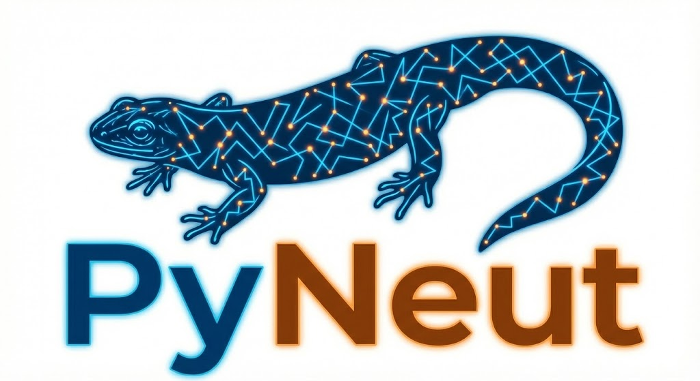

<p align="center">
  
</p>

# PyNeut — Python Neutronics

A Python Monte Carlo code for continuous-energy neutron transport through
user-defined materials and geometries, driven by ENDF/B-VIII nuclear data.
**Intended for educational and research-prototyping use only.**

[](https://www.python.org/)
[](LICENSE)
[](#validation-status)

## Overview

PyNeut implements continuous-energy neutron physics, including:
- Elastic scattering with tabulated ENDF angular distributions and free-gas thermal motion
- Inelastic scattering — discrete levels and continuum / multiplication, (n,2n), (n,3n)
- Energy-dependent cross sections read directly from ENDF/B-VIII HDF5 files
- Multi-region constructive-solid-geometry (planes, spheres, cylinders, boxes, voids, priorities)
- Analog and survival-biased (implicit-capture + roulette) transport
- Parallel particle tracking via `multiprocessing`, mesh tallies (VTK) and trajectory recording

## Requirements

- Python 3.x
- Runtime: `numpy`, `h5py` (see `requirements.txt`)
- Validation suite: `openmc`; geometry tests: `trimesh`, `rtree`

## Installation

```bash
pip install -e .
# or
pip install -r requirements.txt
```

## Quick Start

```python
import numpy as np
from multiprocessing import Pool

from src.cross_section_read import CrossSectionReader
from src.material import Material
from src.medium import Region, Sphere
from src.simulation import simulate_single_particle
from src.vt_calc import VelocitySampler
from src.random_number_generator import RNGHandler
from src.settings import Settings
from src.tally import Tally

reader = CrossSectionReader("./endfb")                       # ENDF/B-VIII data
lead = Material("Lead", 11.35, 208, atomic_weight_ratio=207.2)
sampler = VelocitySampler(lead.kg_mass)

regions = [Region(surfaces=[Sphere((0, 0, 0), 10.0)],
                  name="Lead", priority=1, element="Pb208")]

settings = Settings(mode="shielding", particles=10_000)      # implicit capture
N = settings.num_particles
rngs = [RNGHandler(seed=12345 + i) for i in range(N)]

states = [{
    "x": 0.0, "y": 0.0, "z": 0.0,
    "theta": np.arccos(1 - 2 * r.random()),                  # isotropic
    "phi": r.uniform(0, 2 * np.pi),
    "energy": 2.0e6,                                          # eV
    "weight": 1.0,                                            # required
    "has_interacted": False,
} for r in rngs]

# NOTE the trailing `settings` element in each args tuple.
args = [(s, reader, regions, lead.atomic_weight_ratio, lead.number_density,
         sampler, None, False, r, settings) for s, r in zip(states, rngs)]

with Pool() as pool:
    results = pool.map(simulate_single_particle, args)

tally = Tally()
for res in results:
    tally.merge_partial_results(res)
tally.print_summary(N)
```

See `main.py` for a complete example with a mesh tally, and `docs/QUICK_START.md`
for slab/cylinder/detector variations.

## ENDF/B-VIII Data

Place OpenMC-format HDF5 files in `./endfb/neutron/`. The repo ships ten
isotopes: Al27, B10, Be9, C12, Cd112, Fe56, O16, Pb207, Pb208, U235. More are
available from the [OpenMC data libraries](https://openmc.org/data-libraries/)
or [NNDC ENDF/B-VIII](https://www.nndc.bnl.gov/endf/).

## Code Structure

```
src/
├── cross_section_read.py   # ENDF reader: XS, angular & secondary-energy distributions
├── angular_distribution.py # Tabulated elastic (MT=2) angular sampling
├── material.py             # Material number density & atom mass
├── medium.py               # CSG primitives (Region, Plane, Cylinder, Sphere, Box)
├── geometry.py             # Ray–surface boundary search
├── physics.py              # Elastic/inelastic kinematics, evaporation, anisotropy
├── vt_calc.py              # Free-gas target velocity sampling
├── settings.py             # Transport mode (analog vs implicit capture)
├── simulation.py           # Transport loop + secondary-neutron bank
├── tally.py                # Scalar results accumulation
├── mesh.py                 # Cartesian mesh tally → VTK
└── random_number_generator.py
```

## Validation Status

PyNeut is validated against **OpenMC 0.15** (live, same ENDF/B data, matched
geometry/source), against **exact analytic results**, and at the
**cross-section-reader** level.

Agreement is graded statistically by the z-score
`z = |OpenMC − PyNeut| / √(σ²_OMC + σ²_PyN)` (**OK ≤ 2σ, WARNING ≤ 4σ,
FAIL > 4σ**). The average escape energy uses the same energy histogram in both
codes (binning bias cancels), and the full leakage **spectrum shape** is graded
separately by a coarse-group χ²/dof (GOOD ≤ 2, FAIR ≤ 5, POOR > 5).

| Case | E | Regime | Leak z | E z | Integral | Spectrum |
|------|--:|--------|------:|----:|:--------:|:--------:|
| Pb208 elastic (sph R=10) | 2 MeV | fast | 0.9 | 0.2 | OK | GOOD (0.25) |
| Pb208 (sph R=10) | 5 MeV | fast | 1.0 | 0.3 | OK | GOOD (0.79) |
| Pb208 (n,2n) (sph R=10) | 14 MeV | fast (n,2n) | 0.3 | 0.4 | OK | POOR (28) |
| Fe56 slab (d=2 cm) | 14 MeV | fast (n,xn) | 2.6 | 1.4 | WARN | FAIR (4.7) |
| Fe56 sphere (R=10) | 1 MeV | fast | 1.2 | 0.2 | OK | GOOD (0.71) |
| Fe56 sphere (R=15) | 25 keV | intermediate | 0.1 | 0.0 | OK | GOOD (1.6) |
| Be9 (n,2n) (sph R=10) | 14 MeV | fast (n,2n) | 1.1 | 0.3 | OK | POOR (52) |
| Al27 slab (d=0.5 cm) | 1 MeV | fast | 0.0 | 0.0 | OK | GOOD (1.3) |
| C12 cyl (R=10,H=20) | 2 MeV | fast | 0.0 | 0.6 | OK | GOOD (1.7) |
| O16 sphere (R=20) | 10 MeV | fast | 0.4 | 1.5 | OK | GOOD (1.0) |
| B10 sphere (R=1) | 1 keV | epithermal | 0.2 | 0.7 | OK | POOR (14) |
| Cd112 sphere (R=2) | 0.0253 eV | thermal | 0.1 | 1.4 | OK | GOOD (0.03) |
| C12 sphere (R=5) | 0.0253 eV | thermal | 1.0 | 1.7 | OK | GOOD (0.35) |

**12 OK, 1 warning, 0 failures.** Fast-neutron transport (the intended domain)
agrees with OpenMC within ~2σ on both leakage and spectrum shape. **Thermal
scattering is now validated** — free-gas vector kinematics (below 10 eV) let
neutrons upscatter and equilibrate to the 294 K Maxwellian, so `c12_thermal` and
`cd112_thermal` now pass with GOOD spectra (they were the suite's two failures
before the fix; c12 was 86σ off). The (n,2n) cases pass on integrals and mean
escape energy but their **leakage spectrum shape** is POOR. The single-collision
(n,xn) emission is verified to match OpenMC node-for-node (`validate_secondary.py`,
χ²/dof ≈ 1) — with the CM→lab boost, unit-base outgoing-energy interpolation and
correlated emission angle all applied — so the residual is a transport /
multiple-scattering slowing-down accumulation, not the emission and not the
Maxwellian fallback (which fires **0 %** of the time).

Also: **analytic benchmarks 13/13 PASS** (Beer–Lambert attenuation; elastic
[α,1] / ξ within 0.3σ), the **cross-section reader matches OpenMC to 0.000 %**
on every channel, and the `pytest` suite has **117 passing** tests.

## Physics Models

- **Elastic scattering** — above 10 eV: static-target kinematics + tabulated
  ENDF angular data; below 10 eV: free-gas vector kinematics (target nucleus
  thermal motion sampled → upscatter, equilibrates to the medium temperature).
- **Inelastic (discrete)** — MT 51–90, two-body kinematics, isotropic in CM.
- **Inelastic (continuum / multiplication)** — (n,2n), (n,3n), continuum via
  ENDF Law 61 / Kalbach–Mann correlated sampling, with Law 4 and Maxwellian
  fallbacks. Outgoing energies use unit-base interpolation between incident
  grids, and CM-frame reactions are boosted to the lab frame; the emitted
  neutrons are sampled independently and banked/tracked.
- **Absorption** — MT 102/103/104/105/106/107 summed.
- **Fission** — cross section scored as absorption; no fission neutrons yet.
- **Cross sections** — ENDF/B-VIII, lin–lin interpolation (verified vs OpenMC).

## Limitations

- **Leakage spectrum shape in multiplying/strongly-moderating cases** — integrals
  and mean escape energies agree, but the leakage *spectrum shape* differs in the
  (n,2n) sphere cases and the B10 epithermal case (χ²/dof ≈ 14–50). The
  single-collision (n,xn) emission is **verified to match OpenMC**
  (`validate_secondary.py`: outgoing-energy χ²/dof ≈ 1 at every incident grid
  node) now that the CM→lab frame transform and unit-base outgoing-energy
  interpolation are applied and the correlated emission angle (Law 61 / Kalbach–
  Mann) is used. The residual is therefore a **transport / multiple-scattering
  slowing-down** accumulation (PyNeut slightly under-moderates: deficit at low
  energy, excess at mid energy across many mean-free-paths), not an emission
  defect, and it is **not** the Maxwellian fallback (0 % usage).
- **Thermal scattering is free-gas only (no S(α,β))** — the 294 K free-gas model
  is validated (with upscatter), but molecular/crystalline binding in real
  moderators (water, graphite) is not modelled.
- (n,3n) secondary energies use a 50/50 split approximation.
- Single isotope per region (no material mixtures).
- No fission multiplication / k-eigenvalue (fission is absorption-only).
- Charged-particle and photon products are not transported; neutrons only.
- Source states are built by hand (no built-in spectrum/spatial sampler).
- Geometry limited to planes, spheres and axis-aligned cylinders/boxes.

## Testing

```bash
pytest -q                                              # 117 unit tests
cd Validation/OpenMC_Comparison && python run_all.py   # PyNeut vs OpenMC
python Validation/analytic_benchmarks.py               # exact analytic checks
```

## Documentation

- `readme.md` — this file
- `docs/index.md` — project overview & validation results
- `docs/api-reference.md` — class & function reference
- `docs/QUICK_START.md` — worked examples
- `Validation/OpenMC_Comparison/README.md` — validation suite guide

## Future Work

Ordered by engineering leverage (see `docs/index.md` for the full rationale):

1. **Seamless animation pipeline** — replace the bare-coordinate JSON export with
   a self-describing run bundle (serialised geometry plus per-vertex
   energy/event/weight tracks tagged by `parent_id`) and a generic
   three-dimensional Manim scene, so geometry changes no longer require
   hand-editing the animation script; move the export to a binary container as
   particle counts grow.
2. **Criticality (k-eigenvalue) and a fission-neutron source** — emit ν neutrons
   per fission with a Watt χ spectrum and iterate a fission bank to estimate
   k_eff (MT = 18 is currently absorption only); the secondary bank and
   batch-statistics machinery already exist.
3. **Performance** — profile first (the boundary search and cross-section lookups
   are the suspected hot paths), then take the cheap wins (local-variable state,
   `multiprocessing` chunking) before any Numba/`njit` work, which would demand
   the same array-flattening effort as a full event-vectorised rewrite.
4. **Physics breadth** — material mixtures and natural elements (the largest
   gap), S(α,β) thermal data, multi-temperature and Doppler-broadened libraries,
   a track-length flux estimator, built-in source samplers (Watt, volumetric),
   and additional validated isotopes.
5. **Software hygiene** — replace the ten-element positional argument tuple to
   `simulate_single_particle` with a dataclass, and consolidate the duplicated
   isotope `element_map`.

## References

- ENDF/B-VIII Nuclear Data: https://www.nndc.bnl.gov/endf/
- OpenMC Documentation: https://docs.openmc.org/en/stable/methods/index.html
- Duderstadt & Hamilton, *Nuclear Reactor Analysis*
- J. Wood, *Computational Methods in Reactor Shielding*

## License

[](LICENSE)

## Contact

Youssef — Nuclear and Radiation Engineering, Alexandria University

---

**Disclaimer**: For educational / research-prototyping use only. Not validated
for production, regulatory or safety-critical applications.
